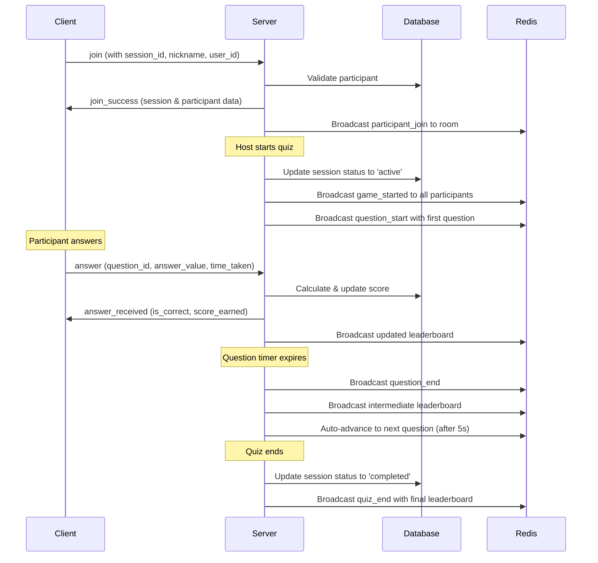

# BTaskee Quiz Service

A comprehensive real-time quiz platform built with Go, featuring WebSocket-based live gameplay, user authentication, and dynamic scoring. Perfect for interactive learning and team building activities.

## ✨ Features

### 🎮 **Real-Time Quiz Gameplay**

- Multi-participant quiz sessions with live updates
- WebSocket-powered real-time communication
- Dynamic scoring based on answer accuracy and response time
- Live leaderboards with automatic ranking updates

### 👥 **User Management**

- User registration and authentication with JWT tokens
- Guest participation support (no account required)
- Host controls for quiz management
- Session-based participant tracking

### 🏆 **Interactive Quiz Experience**

- Multiple question types (single choice, multiple choice, text input)
- Time-limited questions with automatic progression
- Real-time answer validation and scoring
- Intermediate and final leaderboard displays

### 🔧 **Technical Excellence**

- Clean architecture with dependency injection (Google Wire)
- PostgreSQL database with optimized queries (SQLC)
- Redis caching for session management
- Docker containerization for easy deployment
- Comprehensive error handling and logging

## 🏗️ Architecture

```
┌─────────────────┐    ┌─────────────────┐    ┌─────────────────┐
│   Frontend      │    │   Backend       │    │   Database      │
│   (WebSocket)   │◄──►│   (Go/Fiber)    │◄──►│   (PostgreSQL)  │
└─────────────────┘    └─────────────────┘    └─────────────────┘
                               │
                               ▼
                       ┌─────────────────┐
                       │   Redis Cache   │
                       │   (Sessions)    │
                       └─────────────────┘
```

**Core Technologies:**

- **Backend**: Go 1.23+ with Fiber web framework
- **Database**: PostgreSQL with SQLC for type-safe queries
- **Cache**: Redis for session management and real-time features
- **WebSockets**: Real-time bidirectional communication
- **Authentication**: JWT-based with refresh tokens
- **Dependencies**: Google Wire for dependency injection

## 📡 API Documentation

### REST API Endpoints

**Connection:** `http://localhost:8080/api/v1`  
**Production:** `https://btaskee-api.benlab.site/api/v1`

#### Authentication

- `POST /api/v1/auth/signup` - User registration
- `POST /api/v1/auth/signin` - User login
- `GET /api/v1/auth/refresh` - Refresh JWT token

#### Quiz Management

- `POST /api/v1/quizzes/mine` - Create a new quiz
- `GET /api/v1/quizzes/mine` - Get user's quizzes
- `GET /api/v1/quizzes/mine/:quiz_id` - Get quiz details
- `PUT /api/v1/quizzes/mine/:quiz_id` - Update quiz
- `DELETE /api/v1/quizzes/mine/:quiz_id` - Delete quiz
- `GET /api/v1/quizzes` - List public quizzes
- `GET /api/v1/quizzes/:quiz_id` - Get public quiz details

#### Question Management

- `POST /api/v1/questions` - Create questions for quiz
- `GET /api/v1/questions/:quiz_id` - Get quiz questions
- `PUT /api/v1/questions/:question_id` - Update question
- `DELETE /api/v1/questions/:question_id` - Delete question

#### Game Sessions

- `POST /api/v1/sessions` - Create quiz session
- `POST /api/v1/sessions/:join_code/join` - Join session with code
- `GET /api/v1/sessions/:session_id` - Get session details

### WebSocket API

**Connection:** `ws://localhost:8080/api/v1/ws/sessions/:session_id`  
**Production:** `wss://btaskee-api.benlab.site/api/v1/ws/sessions/:session_id`

#### Client → Server Messages

```json
{
  "type": "join",
  "payload": {
    "user_id": 456         // -12382183 (auto generated for Anonymous)
  }
}

{
  "type": "answer",
  "payload": {
    "question_id": 789,
    "question_type": "single_choice",
    "answer_value": "A",                  // single
    "answer_values": ["A", "B", "C"],     // multiple
    "time_taken": 1500
  }
}

{
  "type": "start_quiz",      // Host only
  "type": "next_question",   // Host only
  "type": "pause_quiz",      // Host only
  "type": "resume_quiz",     // Host only
  "type": "end_quiz",        // Host only
  "type": "get_session_state", // Get current state
  "type": "ping"              // Ping
}
```

#### Server → Client Messages

```json
{
  "type": "join_success",
  "payload": {
    "session": {...},
    "participant": {...},
    "is_host": true
  }
}

{
   "type": "participant_join",
   "payload": {
      "joined_at": "2025-07-28T02:58:36.378493+07:00",
      "nickname": "Anonymous Host",
      "participant_id": 1,
      "session_id": 1
   },
   "timestamp": "2025-07-28T02:58:36.378495+07:00"
}

{
    "type": "participant_list_update",
    "payload": {
        "participant_count": 2,
        "participants": [
            {
                "id": 1,
                "is_host": true,
                "nickname": "Anonymous Host",
                "score": 0
            },
            {
                "id": 2,
                "is_host": false,
                "nickname": "Btaskee's Guest",
                "score": 0
            }
        ],
        "session_id": 1,
        "trigger": "websocket_connection",
        "updated_at": "2025-07-28T02:58:36.381775+07:00"
    },
    "timestamp": "2025-07-28T02:58:36.381776+07:00"
}

{
    "type": "quiz_start",
    "payload": {
        "session_id": 1,
        "started_at": "2025-07-28T02:58:49.012133+07:00"
    },
    "timestamp": "2025-07-28T02:58:49.012134+07:00"
}

{
    "type": "question_start",
    "payload": {
        "auto_advance": true,
        "deadline": "2025-07-28T02:59:10.015522+07:00",
        "question": {
            "answers": [
                {
                    "text": "Paris"
                },
                {
                    "text": "London"
                },
                {
                    "text": "Berlin"
                },
                {
                    "text": "Madrid"
                }
            ],
            "id": 1,
            "index": 0,
            "max_score": 1000,
            "question": "What is the capital of France?",
            "time_limit": 20,
            "type": "single_choice"
        },
        "server_time_limit": 20,
        "session_id": 1,
        "started_at": "2025-07-28T02:58:50.015522+07:00"
    },
    "timestamp": "2025-07-28T02:58:50.015522+07:00"
}

{
    "type": "answer_received",
    "payload": {
        "is_correct": true,
        "score_earned": 975,
        "total_score": 975,
        "time_taken": 2500
    },
    "timestamp": "2025-07-28T02:58:54.754523+07:00"
}

{
    "type": "leaderboard",
    "payload": {
        "display_time": 5,
        "leaderboard": [
            {
                "is_host": true,
                "nickname": "Anonymous Host",
                "participant_id": 1,
                "rank": 1,
                "score": 975
            },
            {
                "is_host": false,
                "nickname": "Btaskee's Guest",
                "participant_id": 2,
                "rank": 2,
                "score": 0
            }
        ],
        "next_action": "auto_next_question",
        "server_driven": true,
        "session_id": 1,
        "updated_at": "2025-07-28T02:59:10.02458+07:00"
    },
    "timestamp": "2025-07-28T02:59:10.024581+07:00"
}

{
    "type": "quiz_end",
    "payload": {
        "auto_ended": true,
        "completion_reason": "all_questions_completed",
        "ended_at": "2025-07-28T03:01:10.097022+07:00",
        "final_leaderboard": [
            {
                "is_host": true,
                "nickname": "Anonymous Host",
                "participant_id": 1,
                "rank": 1,
                "score": 1950
            },
            {
                "is_host": false,
                "nickname": "Btaskee's Guest",
                "participant_id": 2,
                "rank": 2,
                "score": 0
            }
        ],
        "server_driven": true,
        "session_id": 1,
        "status": "completed"
    },
    "timestamp": "2025-07-28T03:01:10.097024+07:00"
}
```

## 🚀 Quick Start

### Prerequisites

- Go 1.23 or later
- PostgreSQL 15+
- Redis 7+
- Docker & Docker Compose (optional)

### Option 1: Docker Compose (Recommended)

1. **Clone and setup:**

   ```bash
   git clone <repository-url>
   cd btaskee-quiz-service
   cp .env.example .env
   # Edit .env with your configuration
   ```

2. **Start all services:**

   ```bash
   docker-compose up -d
   ```

3. **Run database migrations:**

   ```bash
   make migrate-up
   ```

4. **Access the application:**
   - API: http://localhost:8080
   - Health check: http://localhost:8080/api/v1/health

### Option 2: Local Development

1. **Install dependencies:**

   ```bash
   # Install Go dependencies
   go mod download

   # Install development tools
   make sqlc-install
   ```

2. **Setup PostgreSQL:**

   ```bash
   # Create database
   createdb btaskee_quiz_db

   # Set environment variables
   export DB_HOST=localhost
   export DB_PORT=5432
   export DB_NAME=btaskee_quiz_db
   export DB_USER=postgres
   export DB_PASSWORD=your_password
   ```

3. **Setup Redis:**

   ```bash
   # Start Redis server
   redis-server

   # Set environment variables
   export REDIS_HOST=localhost
   export REDIS_PORT=6379
   export REDIS_PASSWORD=""
   ```

4. **Run database migrations:**

   ```bash
   make migrate-up
   ```

5. **Generate dependency injection:**

   ```bash
   make di-generate
   ```

6. **Start the application:**

   ```bash
   # Development mode with hot reload
   make dev

   # Or production mode
   make prod
   ```

## ⚙️ Environment Configuration

Create a `.env` file from `.env.example`:

```bash
# Server Configuration
SERVER_HOST=localhost
SERVER_PORT=8080
SERVICE_NAME=btaskee-quiz-service
SERVICE_VERSION=v1
GO_ENV=development

# Database Configuration
DB_HOST=postgres
DB_PORT=5432
DB_NAME=btaskee_quiz_db
DB_USER=postgres
DB_PASSWORD=your-secure-password
DB_SSL_MODE=disable
DB_MAX_OPEN_CONNS=25
DB_MAX_IDLE_CONNS=5
DB_CONN_MAX_LIFETIME=3600

# Redis Configuration
REDIS_HOST=redis
REDIS_PORT=6379
REDIS_PASSWORD=your-redis-password
REDIS_CACHE_DB=0
REDIS_QUEUE_DB=1
REDIS_PREFIX=btaskee_quiz

# JWT Configuration
JWT_ACCESS_SECRET=your-super-secret-jwt-access-key-min-32-chars
JWT_ACCESS_EXPIRATION=900
JWT_REFRESH_SECRET=your-super-secret-jwt-refresh-key-min-32-chars
JWT_REFRESH_EXPIRATION=604800

# CORS Configuration
CORS_ALLOW_ORIGINS=http://localhost:3000,http://localhost:8080
CORS_ALLOW_METHODS=GET,POST,PUT,DELETE,PATCH,OPTIONS
CORS_ALLOW_HEADERS=Origin,Content-Type,Accept,Authorization
CORS_ALLOW_CREDENTIALS=true

# Rate Limiting
RATE_LIMIT_RPS=10.0
RATE_LIMIT_BURST=20
```

## 🎯 Business Flow & Game Mechanics

### 1. User Registration & Authentication

```
User Registration → JWT Token Generation → Access & Refresh Tokens
     ↓
User Login → Token Validation → Authenticated Session
```

### 2. Quiz Creation & Management

```
Authenticated User → Create Quiz → Add Questions → Publish Quiz
        ↓
Quiz Owner → Create Session → Generate Join Code → Share with Participants
```

### 3. Real-Time Game Session Flow

#### Phase 1: Session Setup

```
Host creates session → Generates unique join code → Participants join via code
     ↓
WebSocket connections established → Participant list updates in real-time
     ↓
Host starts quiz → All participants receive quiz_start event
```

#### Phase 2: Question Cycle

```
Server broadcasts question → Participants see question with timer
     ↓
Participants submit answers → Server validates & calculates scores
     ↓
Score updates broadcast → Live leaderboard updates
     ↓
Question timer expires → Intermediate leaderboard shown (5 seconds)
     ↓
Auto-advance to next question OR end quiz if last question
```

#### Phase 3: Scoring System

```
Base Score: 1000 points per correct answer
Time Penalty: -1 point per 100ms delay
Minimum Score: 100 points for any correct answer
Wrong Answer: 0 points

Final Score = max(Base Score - Time Penalty, Minimum Score) if correct, 0 if wrong
```

#### Phase 4: Real-time Updates

```
Answer Submission → Immediate score calculation → Database update
     ↓
WebSocket broadcast → All participants see updated leaderboard
     ↓
Ranking calculation → Live position updates
```

#### Phase 5: Session Management

```
Host Controls:
- start_quiz: Begin the quiz session
- next_question: Manually advance questions
- pause_quiz: Temporarily halt the game
- resume_quiz: Continue paused game
- end_quiz: Finish and show final results

Auto Controls:
- Question timeouts trigger automatic progression
- Last question auto-ends the quiz
- Leaderboard displays for 5 seconds between questions
```

### 4. WebSocket Event Flow



### 5. Database Schema Overview

#### Core Tables

- **users**: User accounts and authentication
- **quizzes**: Quiz metadata and settings
- **questions**: Individual quiz questions and answers
- **quiz_sessions**: Active game sessions
- **session_participants**: Real-time participant data and scores

#### Key Relationships

```
users (1) ──→ (many) quizzes
quizzes (1) ──→ (many) questions
quizzes (1) ──→ (many) quiz_sessions
quiz_sessions (1) ──→ (many) session_participants
users (1) ──→ (many) session_participants
```

## 🧪 Testing the Application

### Manual Testing

1. **API Testing with cURL:**

   ```bash
   # Health check
   curl http://localhost:8080/api/v1/health

   # Register user
   curl -X POST http://localhost:8080/api/v1/auth/signup \
     -H "Content-Type: application/json" \
     -d '{"email":"test@example.com","password":"password123","first_name":"John","last_name":"Doe"}'

   # Login
   curl -X POST http://localhost:8080/api/v1/auth/signin \
     -H "Content-Type: application/json" \
     -d '{"email":"test@example.com","password":"password123"}'
   ```

2. **Multi-User WebSocket Testing:**

   ```bash
   # Use wscat to test WebSocket connections
   npm install -g wscat

   # Connect to session (replace session_id)
   wscat -c wss://btaskee-api.benlab.site/api/v1/ws/sessions/1

   # Send join message
   {"type":"join","payload":{"user_id":123}}
   ```

3. **Load Testing:**

   ```bash
   # Install hey for load testing
   go install github.com/rakyll/hey@latest

   # Test API endpoints
   hey -n 1000 -c 10 http://localhost:8080/api/v1/health
   ```

### Unit Testing

```bash
# Run all tests
go test ./...

# Run tests with coverage
go test -cover ./...

# Run specific test package
go test ./internal/services/...

# Run tests with verbose output
go test -v ./internal/handlers/...
```

## 🔧 Development Tools

### Makefile Commands

```bash
# Build application
make build

# Development with hot reload
make dev

# Production mode
make prod

# Generate dependency injection
make di-generate

# Database operations
make migrate-up          # Apply migrations
make migrate-down        # Rollback migrations
make migrate-add         # Create new migration

# Code generation
make sqlc-generate       # Generate type-safe SQL code

# Code quality
make lint                # Run linter
make tidy                # Clean up dependencies
make test                # Run tests
make test-cov           # Run tests with coverage
```

### Database Migrations

```bash
# Create a new migration
make migrate-add name=create_new_table

# Apply all pending migrations
make migrate-up

# Rollback last migration
make migrate-down

# Check migration status
go run ./cmd/migrate status
```

## 📁 Project Structure

```
btaskee-quiz-service/
├── app/                        # Application initialization & dependency injection
│   ├── server.go              # Main server setup and lifecycle
│   ├── wire.go                # Wire dependency injection configuration
│   └── wire_gen.go            # Generated dependency injection code
│
├── cmd/                        # Application entry points
│   ├── app/main.go            # Main application entry
│   └── migrate/main.go        # Database migration tool
│
├── config/                     # Configuration management
│   ├── config.go              # Configuration structures
│   └── provider.go            # Config provider for dependency injection
│
├── internal/                   # Private application code
│   ├── database/              # Database layer
│   │   ├── db.go              # Database connection management
│   │   ├── migrations/        # SQL migration files
│   │   ├── queries/           # Raw SQL queries
│   │   └── sqlc/              # Generated type-safe database code
│   │
│   ├── dtos/                  # Data Transfer Objects
│   │   ├── auth_dto.go        # Authentication request/response types
│   │   ├── quiz_dto.go        # Quiz-related DTOs
│   │   └── session_dto.go     # Session management DTOs
│   │
│   ├── events/                # Event handling (WebSocket)
│   │   └── game_event_handler.go # Real-time game event processing
│   │
│   ├── guards/                # Authentication & authorization
│   │   └── auth_guard.go      # JWT token validation
│   │
│   ├── handlers/              # HTTP & WebSocket handlers
│   │   ├── auth_handler.go    # Authentication endpoints
│   │   ├── quiz_handler.go    # Quiz management endpoints
│   │   ├── game_handler.go    # Game session endpoints
│   │   └── websocket_handler.go # WebSocket connection handling
│   │
│   ├── models/                # Domain models
│   │   ├── user_model.go      # User entity
│   │   ├── quiz_model.go      # Quiz entity
│   │   ├── session_model.go   # Game session entity
│   │   └── ws_model.go        # WebSocket message types
│   │
│   ├── repositories/          # Data access layer
│   │   ├── user_repository.go # User data operations
│   │   ├── quiz_repository.go # Quiz data operations
│   │   └── session_repository.go # Session data operations
│   │
│   ├── services/              # Business logic layer
│   │   ├── auth_service.go    # Authentication business logic
│   │   ├── quiz_service.go    # Quiz management business logic
│   │   └── session_service.go # Game session business logic
│   │
│   └── transformers/          # Data transformation utilities
│       ├── quiz_transformer.go # Quiz data transformations
│       └── session_transformer.go # Session data transformations
│
├── pkg/                        # Shared/public packages
│   ├── cache/                 # Redis caching utilities
│   ├── constants/             # Application constants
│   ├── errors/                # Custom error types
│   ├── fiber/                 # Fiber web framework setup
│   ├── logger/                # Logging utilities
│   ├── middlewares/           # HTTP middlewares
│   ├── response/              # Standardized API responses
│   └── websocket/             # WebSocket hub and client management
│
├── utils/                      # Utility functions
│   ├── concurrent.go          # Concurrency helpers
│   ├── hash.go               # Hashing utilities
│   ├── pagination.go         # Pagination helpers
│   └── validator.go          # Validation utilities
│
├── docker-compose.yml          # Docker services configuration
├── Dockerfile.dev             # Development Docker image
├── Dockerfile.prod            # Production Docker image
├── Makefile                   # Development commands
├── go.mod                     # Go module definition
├── go.sum                     # Go module checksums
└── sqlc.yaml                  # SQLC configuration
```

## 🚀 Deployment

### Docker Production Deployment

1. **Build production image:**

   ```bash
   docker build -f Dockerfile.prod -t btaskee-quiz-service:latest .
   ```

2. **Deploy with Docker Compose:**

   ```bash
   # Set production environment
   export GO_ENV=production
   export DOCKER_IMAGE=btaskee-quiz-service:latest

   # Deploy
   docker-compose -f docker-compose.yml up -d
   ```

3. **Health check:**
   ```bash
   curl http://your-domain.com/api/v1/health
   ```

### Kubernetes Deployment

```yaml
# k8s-deployment.yaml
apiVersion: apps/v1
kind: Deployment
metadata:
  name: btaskee-quiz-service
spec:
  replicas: 3
  selector:
    matchLabels:
      app: btaskee-quiz-service
  template:
    metadata:
      labels:
        app: btaskee-quiz-service
    spec:
      containers:
        - name: quiz-service
          image: btaskee-quiz-service:latest
          ports:
            - containerPort: 8080
          env:
            - name: GO_ENV
              value: "production"
            - name: DB_HOST
              value: "postgres-service"
            - name: REDIS_HOST
              value: "redis-service"
```

## 🔒 Security Features

- **JWT Authentication**: Secure token-based authentication with refresh tokens
- **Password Hashing**: Bcrypt hashing for secure password storage
- **Rate Limiting**: Configurable rate limiting for API endpoints
- **CORS Protection**: Configurable CORS policies
- **Input Validation**: Comprehensive request validation
- **SQL Injection Prevention**: Type-safe queries with SQLC
- **Error Handling**: Secure error responses (no sensitive data leakage)

## 📊 Monitoring & Logging

### Logging

- Structured JSON logging with Zap
- Configurable log levels
- Request/response logging
- Error tracking with context

### Metrics

```bash
# Application metrics available at
GET /api/v1/health

# Response includes:
{
  "status": "healthy",
  "timestamp": "2025-01-15T10:30:00Z",
  "uptime": "2h30m45s",
  "database": "connected",
  "redis": "connected"
}
```
